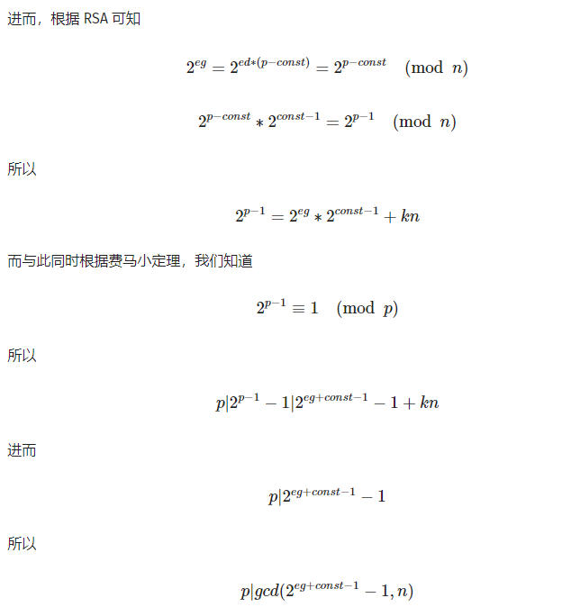

# rsa
## **【原理】**
	
	其中有n e 密文 求d
## **【目的】**
	解密
## **【环境】**
	python3
## **【 工具】**
     
## **【步骤】**
第一题
基础
L=(p-1)*(q-1)
d=gmpy2.invert(e,L)

答案 ：17441289092942773579
第二题
	因式分解 n 用yafu 
 ./yafu-x64
factor(920139713)
***factors found***

P5 = 49891
P5 = 18443

ans = 1
求出 p q 求d
rsa 解密pow（m,d,n) toStr解码 打印出来
python 脚本如下
def toStr(i):
    result = ""
    while i != 0:
        result = chr(i % 256) + result
        i = i / 256
    return result
def egcd(a, b):
    if a == 0:
      return (b, 0, 1)
    else:
      g, y, x = egcd(b % a, a)
      return (g, x - (b // a) * y, y)
def modinv(a, m):
    g, x, y = egcd(a, m)
    if g != 1:
      raise Exception('modular inverse does not exist')
    else:
      return x % m
def toD():
    p = 49891
    q = 18443
    e = 23
    return modinv(e,920071380)
B = [140673733L, 788924015L, 392780623L, 198944619L, 393316622L, 555447110L, 163544915L, 406969418L, 203273996L, 643818321L, 153693460L, 794158833L, 259074004L, 422578821L, 392234567L, 770980747L, 406116314L, 469239388L, 476761633L, 727936101L, 806243412L]
n = 920139713
d = toD()
result = ""
for b in B:
    a=pow(b,d,n)
    result += toStr(a)
print result

结果：JNCTF{bPIyUqWKHh3Se6}

第三题
设两个用户的公钥分别为 e1和 e2，且两者互质。明文消息为 m，密文分别为：
c1=m^e1modN
c2=m^e2modN
当攻击者截获 c1和 c2后，就可以恢复出明文。用扩展欧几里得算法求出 
r^e1+s^e2=1modn的两个整数 r和 s，由此可得：c1^r*c2^s≡mmodn

代码
import binascii
import gmpy2
n = 641943540730023777824392866638157340370767923554603348212416381407690524951766999153588195962371365548958645926411257295906080037076004150161520267063144928540431662998284364558326715964447571398821610089295800942875866602293736575979557352946001408763609749410396290917521967511358634604884961707922971572476717752888224490450545137878736137624073067000853300255000865105240340750090750498813038399089721714005748116154010294044492818814393240212243592178736160396358917003700687384114451788134043992158377683359616847365426071317924984868030057926715831104080386056346964698541871951947169699051360271674295899937757143028503122064786605120876829570027682605090878483978893328114237061836678118950097541480674420734501817402327395287208014422053026730979792133790573935686891203183328511250776511529059741334360839606130503324966782314739505075494180602342666105242003012226481095794906054746977211355068954095609414448636597270454187292894508557043031144811945034221562020781951174880815739055203006020460786470801748991617836160197022726803774154101865789437975318314818149435604497368603459443541842717099512887897971783694925225085541956870965476733041386294526845663072063012954851683858059844936988567793900336522802183276297

e1 = 773

e2 = 839

message1=344940806706412168915655472081256857931836308695730405737836867494415936233018134895837822042048754983146383763505959544673959641080647643046751252174159188998533390039896427235302835264360773240353468985184729017883468344693357844291200935833102169005236559894082466305440705946317604987495883379815129831437334251559092843905248462310245448631875487011816407608086688518831732233978110411775345835241214350260251182765919855154309726501064066184030560737576658107148307500988573672372748230759080995479715900113872737583659063183718616523378284952074544479062909865286240558472976635206534569046674622528708464482891865002571298612902089296461973607755361117759693897824693401710803455945041972093857250452358465460293065113649990671231230488640356109351223394741554794746335822257205699363190822863367125736104501521577308339318305709761032713389312730211357849222241307591807639254729488750157207351895419697469679558197264799650120033686797529984609351643448373181968523680857320394693446665530511625629191177495458663200292895691253906399222244346952394130111570056585353493750800779882036439073399438989912178458213201269472988638546869271115637471343507105560618121586548042264729153995475644507939883015859766990395346826911
message2=579030382652027220397529139010787122826121025990426457633325044583471008590499936233610401806692749526238476379578064757368267737202221383256897181505522243489331318005350135879639942992223890025189417513671903282090534720004287803790980512612587862790960947843861721274374654801013780147809054404621945121386340869833070078713842444404441666838237061058531015341663267265007596158493148463922131442207674459513410384925639429602040713786623759149936831665535689382157910898239743993151562861383506346776479864123073103373426493753589313817306470258323034982245701952380779861614794143903909909175647348392473795345642742649466420858517719292416200063518491327027974256230087828738186614201317524093499368997182513473087575717022275279620676284116867090560856241649046489586359963916201720728073177226414292337544087220758745626891968541879182018013149536523741753848773774185052295156265245511408040792526403690528189260659755657135631136444688487680461348904415785583015946289200444472373109479098798910029608421423091459014477834164043486627824842910959454994243534457823368677549671501754489705524177821214873946604597536175902548778426046757503445939683579340166256074636192372948721312434513784083279146741375592737764456275470

# s & t
gcd, s, t = gmpy2.gcdext(e1, e2)
if s < 0:
    s = -s
    message1 = gmpy2.invert(message1, n)
if t < 0:
    t = -t
    message2 = gmpy2.invert(message2, n)
plain = gmpy2.powmod(message1, s, n) * gmpy2.powmod(message2, t, n) % n
print (plain)
i = 0
flag = binascii.unhexlify(hex(plain)[2:])
print(flag)
# 30567598110135559432343518150112006330821129102823707049743500413
# b'JNCTF{7Mt6vww9RoZucRkdRXjD}'

第四题

原理如下图

代码如下
import binascii
import gmpy2

data = 81590676479152376830699493687824396022648261170020122927549574190018958458526493045701433855605317417674881391939033375964570186790620168360327699136296756690880768785447501920755027399028056225289901673683047461456727272035001403452477753117823116786118986078592891761941835197939414473485972134094937371143

n =115778002875445193621761585141146486740633114862313899547622975272994465604121232189623934050763106450521691325120334655171096300114737705346886917829086086028902722555846963671989477333100682431593906020556013544169301451485538850694440440334310846393306756370579848965914774655733052929276550351223401114441

h = 412013830360120426404823727696774405055944433418606196428982470021895357569475303346766533611481007159666410073789089568699501308099294612237400674961051994
g = 1027580037761768699976646689035796833770749901868506927151139307666847895860521867227446715606369389427860517513843951834076371935523457345453476456368139261996724857534775543957184110480946932807853984101458052216438457821730706493156467926217124103950220255631601976388090050529450250678967050086634543709362904010335196005397012984502685996082966068975204966176822161820665171863466042514405310647266390704432701701711804971103335815550237034630648884878680676

e = 65537
const = 0xdeadbeef

tmp = gmpy2.powmod(2,e*g+const-1,n)-1
p = gmpy2.gcd(tmp,n)
q = n//p
phin = (p-1)*(q-1)
d =gmpy2.invert(e,phin)
plain = gmpy2.powmod(data,d,n)
print (plain)
print(binascii.unhexlify(hex(plain)[2:]))
# b'JNCTF{0n8B2ZGoEmb7ZXmO8UVA}'

第五题

## **【总结】**
	看返回值

