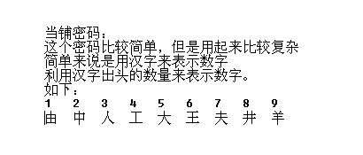

# 太平要术
## **【原理】**

FLAG转ASCII，十进制形式的ASCII再转当铺密码，当铺密码用Base64编码。

## **【目的】**

考察同学们的见识，是不是能认出或自己分析出当铺密码

## **【环境】**

无

## **【工具】**

无

## **【步骤】**

先解Base64，得“夫工 夫井 王夫 井工 夫口 由中人 王夫 由口工 由口大 由由口 由口由 由由大 由口由 羊大 羊夫 由由工 由口由 羊大 由由王 由口工 由口由 羊大 羊井 由口由 由由大 由由王 羊大 由口井 羊夫 由由口 由口人 由由夫 羊夫 由口人 由口由 由中大”，通过对应汉字解出数字，很容易看出是ascii码的十进制形式。

FLAG：JNCTF{Chinese_are_the_best_language}

## **【总结】**

没啥好总结的
