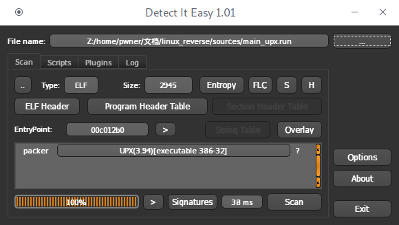
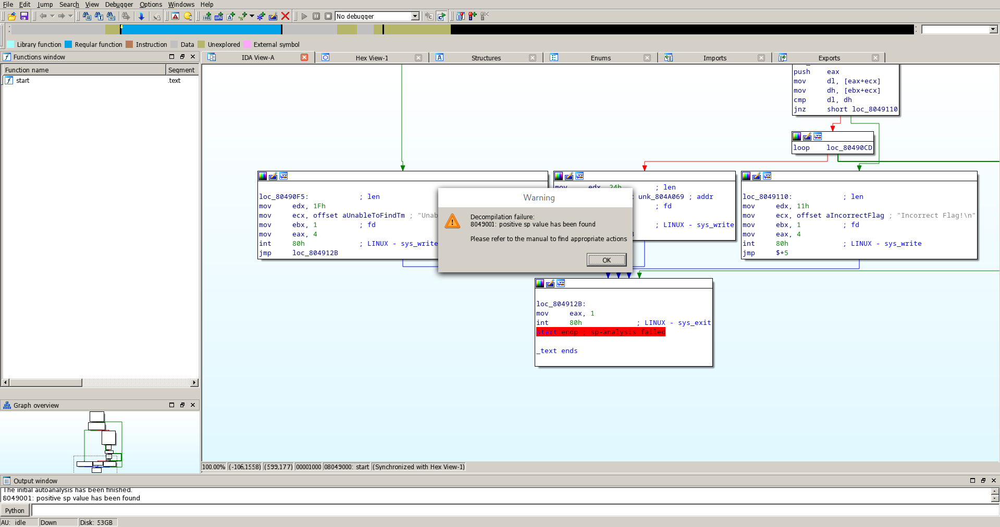
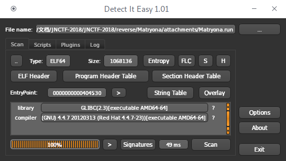
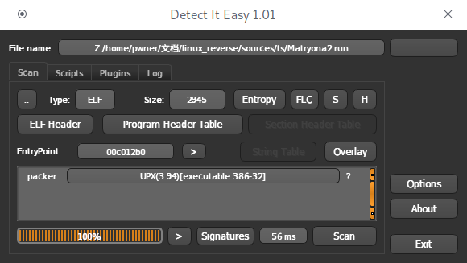
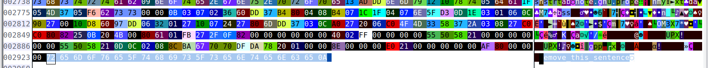

## JNCTF-2018 : Matryona 

## **【原理】**

Matryona Doll 意为俄罗斯套娃，嵌套的神秘与未知是俄罗斯套娃的魅力也是本题的特点

本题最内层程序采用32位汇编程序编译，向外依次以upx,appimage工具加以包裹，最终生成64位的appimage程序Matryona.run

### 说明0:UPX

upx为一种常见的打包工具，采用DIE可以检测出其文件格式



upx脱壳命令 upx -d ,但upx会验证文件大小，当文件大小错误时会导致解压失败

```bash
$sources upx -d ./main_upx.run 
...
upx: ./main_upx.run: CantUnpackException: header corrupted 2
Unpacked 0 files.
```

本题在upx打包后在文件最后加入提示语"remove_this_sentence",使用strings命令可以发现，移除后即可使用upx -d命令解压

### 说明1:Appimage

appimage文件为一种包含程序二进制与所需资源的文件格式，整体为一个可执行文件,程序资源在Squashfs filesystem中

```bash
$binwalk attachments/Matryona.run 

DECIMAL       HEXADECIMAL     DESCRIPTION
--------------------------------------------------------------------------------
137370        0x2189A         Unix path: /github.com/AppImage/AppImageKit/wiki/FUSE
138568        0x21D48         Unix path: /github.com/AppImage/AppImageKit/wiki/FUSE
139648        0x22180         SHA256 hash constants, little endian
140120        0x22358         xz compressed data
140160        0x22380         CRC32 polynomial table, little endian
187496        0x2DC68         Squashfs filesystem, little endian, version 4.0, compression:gzip, size: 878361 bytes, 9 inodes, blocksize: 131072 bytes, created: 1970-01-01 00:00:00
```

appimage的解包:

1. appimage内置解压命令 Matryona.run --appimage-extract

2. 使用binwalk -e Matryona.run 也可以得到主文件Matryona.run,但这样会破坏文件夹结构

```
Matryona.AppDir
├── AppRun
├── icon.png
├── Matryon.desktop
└── usr
    ├── bin
    │   └── Matryona.run
    └── lib
```

### 说明3:syscall

#### 介绍

syscall() 执行一个系统调用，根据指定的参数number和所有系统调用的汇编语言接口来确定调用哪个系统调用。系统调用所使用的符号常量可以在头文件<sys/syscll.h>里面找到。

#### 功能

主要分为3大类：

(1)进程控制类

fork 创建一个子进程

clone  按照指定条件创建子进程

execve 运行可执行文件

...

(2)文件控制操作

open 打开文件

read 读文件

write 写文件

...

(3)系统控制

ioctl I/O总控制函数

reboot重新启动

—sysctl读写系统参数

#### 例子

| name                                                         | eax  | ebx             | ecx                    | edx          |
| ------------------------------------------------------------ | ---- | --------------- | ---------------------- | ------------ |
| [ sys_write](http://www.kernel.org/doc/man-pages/online/pages/man2/write.2.html) | 0x04 | unsigned int fd | const char __user *buf | size_t count |

helloworld.asm

```assembly
global _start

section .data                       ;数据段
    string0: db "hello world",0xa,0 ;存储"hello world"字符串
    len0: equ $-string0             ;字符串长度
section .text                       ;代码段
	mov edx,len0					;写入长度
    mov ecx,string0					;写入位置
    mov ebx,1						;1表示标准输出
    mov eax,4						;syscall(4) write
    int 0x80                        ;syscall
```

参考资料： [x86 syscall](https://syscalls.kernelgrok.com/)

### 说明4:ptrace与反调试

#### ptrace

ptrace()系统调用函数提供了一个进程（the “tracer”）监察和控制另一个进程（the “tracee”）的方法。并且可以检查和改变“tracee”进程的内存和寄存器里的数据。它可以用来实现断点调试和系统调用跟踪。

返回值： 成功调用返回需要的数据，调用失败返回-1

#### 反调试

在利用gdb,edb等反调试工具进行动态调试时，调试器会使用ptrace系统调用attach到运行中的程序。
一次仅有一个程序被允许这么做，我们可以利用这个特性来检测调试器，实现反调试。

```asm
    mov eax,0x1a
    mov ebx,0
    mov ecx,0
    mov edx,1
    mov esi,0
    int 0x80 ;ptrace()
    cmp eax,-1
    je _exit ;根据ptrace()返回值以判断是否被调试
```

### 说明5:栈帧平衡与反IDA反汇编插件

在正常的程序中，调用函数前后帧栈需保持平衡，恶意的入栈出栈操作可造成栈帧的不平衡，从而干扰IDA反汇编插件工作



## **【目的】**

考察对strings,binwalk等常用工具的启发性使用

考察对Linux系统调用syscall的掌握

考察对常见反调试反分析行为的应对

考察对汇编代码的阅读分析能力

## **【环境】**

具有32位兼容库的Linux系统

## **【工具】**

file			查看文件的头部信息来获取文件类型

strings		获取二进制文件中的可读字符串

binwalk          二进制分析工具，自动完成指定文件的扫描，智能发掘潜藏在文件中所有可疑的文件类型及文件系统

DIE                  全平台查壳脱壳软件，支持Linux与Windows程序

wxHexEditor 十六进制编辑器

## **【步骤】**

### 步骤0:Matryona.run文件分析

#### file

```bash
$file ./Matryona.run 
./Matryona.run: ELF 64-bit LSB executable, x86-64, version 1 (SYSV), dynamically linked, interpreter /lib64/ld-linux-x86-64.so.2, for GNU/Linux 2.6.18, stripped
```
样本为64位无符号可执行程序

#### strings

```bash
$strings Matryona.run 
/lib64/ld-linux-x86-64.so.2
libdl.so.2
...
AppImage options:
  --appimage-extract [<pattern>]  Extract content from embedded filesystem image
                                  If pattern is passed, only extract matching files
  --appimage-help                 Print this help
  --appimage-mount                Mount embedded filesystem image and print
                                  mount point and wait for kill with Ctrl-C
  --appimage-offset               Print byte offset to start of embedded
                                  filesystem image
  --appimage-portable-home        Create a portable home folder to use as $HOME
  --appimage-portable-config      Create a portable config folder to use as
                                  $XDG_CONFIG_HOME
  --appimage-signature            Print digital signature embedded in AppImage
  --appimage-updateinfo[rmation]  Print update info embedded in AppImage
  --appimage-version              Print version of AppImageKit
...
You might still be able to extract the contents of this AppImage 
if you run it with the --appimage-extract option. 
...
AppImage by Simon Peter, http://appimage.org/
...
```

从中我们能够了解该文件的类型，以及各种操作命令

得到利用"-appimage-extract"命令行可以将程序解压的重要信息

#### DIE



64位可执行文件，未加壳

#### binwalk

```bash
$binwalk ./Matryona.run 
DECIMAL       HEXADECIMAL     DESCRIPTION
--------------------------------------------------------------------------------
137370        0x2189A         Unix path: /github.com/AppImage/AppImageKit/wiki/FUSE
138568        0x21D48         Unix path: /github.com/AppImage/AppImageKit/wiki/FUSE
139648        0x22180         SHA256 hash constants, little endian
140120        0x22358         xz compressed data
140160        0x22380         CRC32 polynomial table, little endian
187496        0x2DC68         Squashfs filesystem, little endian, version 4.0, compression:gzip, size: 878361 bytes, 9 inodes, blocksize: 131072 bytes, created: 1970-01-01 00:00:00
```

获取一个网址github.com/AppImage/AppImageKit/wiki/FUSE

该elf文件存在使用binwalk工具拆分提取的可能

### 步骤1:Matryona.run文件提取

#### 途径0
根据strings分析步骤得到的提示，解压可执行文件
```bash
$./Matryona.run --appimage-extract
squashfs-root/.DirIcon
squashfs-root/AppRun
squashfs-root/Matryon.desktop
squashfs-root/icon.png
squashfs-root/usr
squashfs-root/usr/bin
squashfs-root/usr/bin/Matryona.run
squashfs-root/usr/lib
$tree squashfs-root 
squashfs-root
├── AppRun
├── icon.png
├── Matryon.desktop
└── usr
    ├── bin
    │   └── Matryona.run
    └── lib

3 directories, 4 files
```

分析目录结构，得到下一个分析对象usr/bin/Matryona.run

```bash
$cat squashfs-root/Matryon.desktop 
[Desktop Entry]
Name=Matryona
Exec=bin/Matryona.run
Icon=icon
Type=Application
```

#### 途径1

直接使用binwalk提取

```bash
$binwalk -e ./Matryona.run
...
$ls 
Matryona.run  _Matryona.run.extracted
$tree _Matryona.run.extracted
$tree _Matryona.run.extracted 
_Matryona.run.extracted
├── 22358.xz
├── 2DC68.squashfs
├── AppRun
├── bin
├── icon.png
├── lib
├── Matryona.run
├── Matryon.desktop
├── squashfs-root
└── usr

4 directories, 6 files
```

分析各目录与文件，确定真正的可执行文件为Matryona.run

```bash
$cat _Matryona.run.extracted/Matryon.desktop 
[Desktop Entry]
Name=Matryona
Exec=bin/Matryona.run
Icon=icon
Type=Application
```

**为表区别，此步骤中得到的文件命名为Matryona2.run**

### 步骤2:Matryona2.run文件分析

参考步骤0操作，重复部分不再赘述，列出关键信息

#### DIE



Matryona为upx加壳的32位程序

#### strings

```
$strings 
...
UPX! //验证使用UPX压缩
...
remove_this_sentence
```

发现可疑字符段“remove_this_sentence”

### 步骤3:Matryona2.run文件提取

尝试使用upx工具解压

```bash
$sources upx -d ./Matryona2.run -o Matryona2_unpacked.run
...
upx: ./main_upx.run: CantUnpackException: header corrupted 2
Unpacked 0 files.
```

提示文件头错误，解压失败

这通常表示文件被人为修改，配合步骤2发现的可疑字符段“remove_this_sentence”，修正被修改的部分或许是有必要的

#### 修正upx文件

使用wxHexEditor打开Matryona2.run



在文件末发现二进制字符串"remove_this_sentence\n"

删除该字段，另存文件为Matryona2_fixed.run

#### upx解压

```bash
$upx -d Matryona2_fiexed.run -o Matryona2_unpacked.run
                       Ultimate Packer for eXecutables
                          Copyright (C) 1996 - 2017
UPX 3.94        Markus Oberhumer, Laszlo Molnar & John Reiser   May 12th 2017

        File size         Ratio      Format      Name
   --------------------   ------   -----------   -----------
      8672 <-      2924   33.72%   linux/i386    Matryona2_fiexed.run

Unpacked 1 file.
```

得到去壳文件**Matryona2_unpacked.run**

### 步骤4:Matryona2_unpacked.run文件分析

参考步骤0操作，重复部分不再赘述，列出关键信息

文件Matryona2_unpacked.run为32位stripped可执行程序，无加壳，亦无binwalk可提取的内部结构

#### strings

```bash
$strings Matryona2_unpacked.run
Welcome to JNCTF,enjoy yourself~
Your Flag is
JNCTF{
Unable to find /tmp/flag.txt!
Incorrect Flag!
Congruduations!This the right flag!
/tmp/flag.txt
Welcome_To_JNWA!
.shstrtab
.note.gnu.property
.text
.data
.bss
```

对该文件使用strings命令分析，得到程序内部字符串明文，可以推测该

```
读取/tmp/flag.txt->内部运算->根据运算给出正确或错误的结果
```

### 步骤5:反汇编分析

利用反汇编工具查看反编译汇编,分析关键逻辑

##### 数据读取

open()，read()两个操作读取文件到buf

```asm
_readfile:
    pop ecx;干扰反汇编
    mov ecx,0
    mov ebx,filename
    mov eax,5
    int 0x80 ;open()
    cmp eax,0
    jl _error0
    push eax
    mov edx,bufsize
    mov ecx,buf
    pop ebx
    mov eax,3
    int 0x80 ;read()
```

##### 加密循环

将buf与keyword逐字符xor，将结果存入buf

```asm
_encrypt:
    mov ecx,16
    lea eax,[buf]
    lea edx,[keyword]
begin0:
    pop ebx;干扰反汇编
    mov bl,[eax+ecx-1]
    mov bh,[edx+ecx-1]
    xor bl,bh
    mov [eax+ecx],bl
    loop begin0
```

##### 比较循环

逐字符比较buf与stringx

```assembly
_compare:
    lea eax,[buf]
    lea ebx,[stringx-1]
    pop ecx
    mov ecx,16
begin1:
    push eax;干扰反汇编
    mov dl,[eax+ecx]
    mov dh,[ebx+ecx]
    cmp dl,dh
    jne _error1
    loop begin1
```

##### 数据

```assembly
section .data
   keyword: db "Welcome_To_JNWA!",0xa,0
   stringx: db "% ]",0x10,"K_T",0x1e,"'",0x16,"9",0xa,"<}",0x14,"_",0
```

##### 获取flag

理清逻辑之后，实现反向过程即可

```python
def strxor(a, b):     # xor two strings of different lengths
    if len(a) > len(b):
        return "".join([chr(ord(x) ^ ord(y)) for (x, y) in zip(a[:len(b)], b)])
    else:
        return "".join([chr(ord(x) ^ ord(y)) for (x, y) in zip(a, b[:len(a)])])

>>> strxor("% ]\x10K_T\x1e'\x169\n<}\x14_","Welcome_To_JNWA!")
"rE1s$21Asyf@r*U~"
```

**JNCTF{rE1s$21Asyf@r*U~}**

## 【总结】

不能以战术上的勤奋，掩盖战略上的懒惰