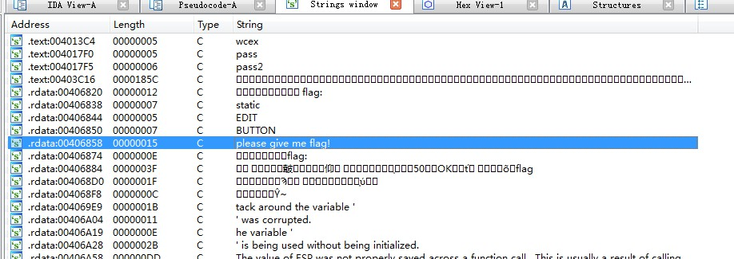
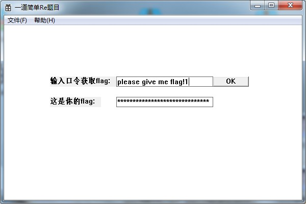
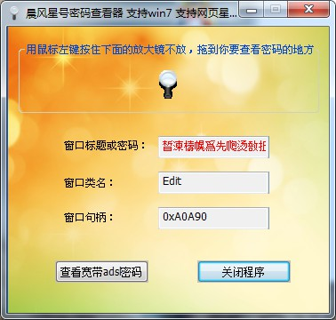
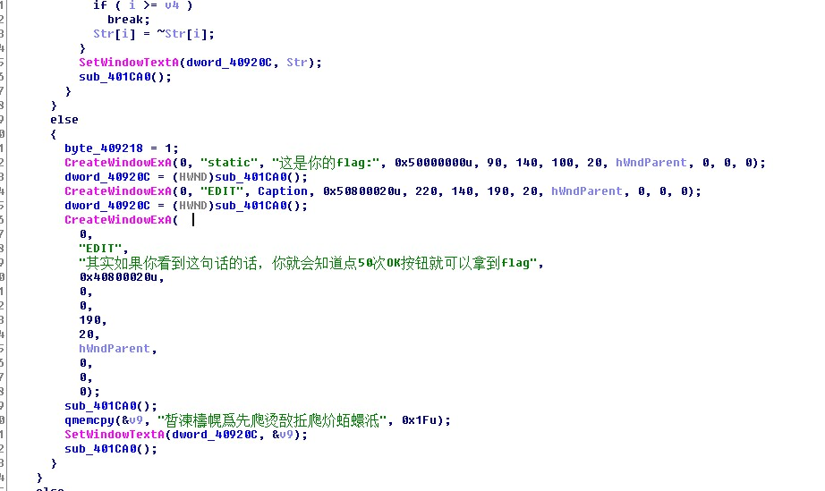
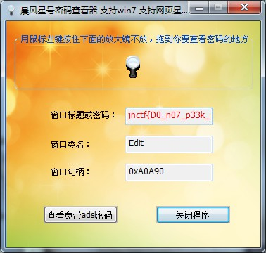

# JNCTF-2018 : easy_re

## **【原理】**

获取密码框内容

## **【目的】**

一道简单的re

## **【环境】**

windows

## **【工具】**

ida,OD,某星号密码查看器

## **【步骤】**

1 用ida打开，查找字符串，找到口令

2 输入口令，得到加密后的flag

3 使用某星号密码查看器，发现密码框中是乱码

4 在ida中发现提示

5 按50次OK（其实按10次就行了），看似没什么变化，再用某星号密码查看器查看得到flag

【另解】

- 静态分析结合动态调试，得到一开始加密后的flag，每一位异或一下0xFF就得到最终flag了

## **【总结】**

现在的密码用这个都获取不到了

