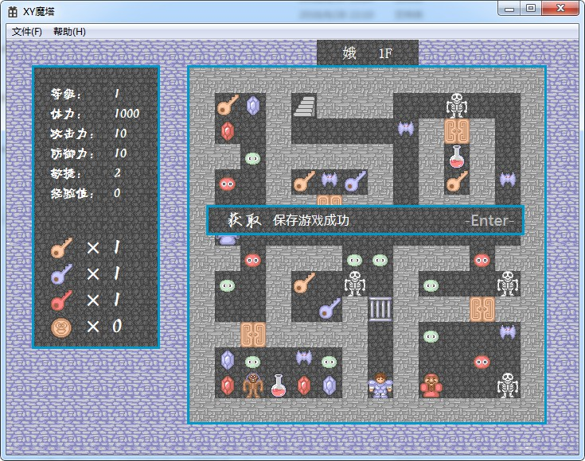
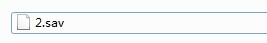
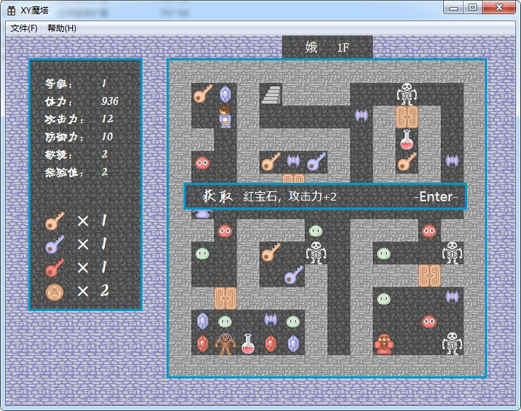
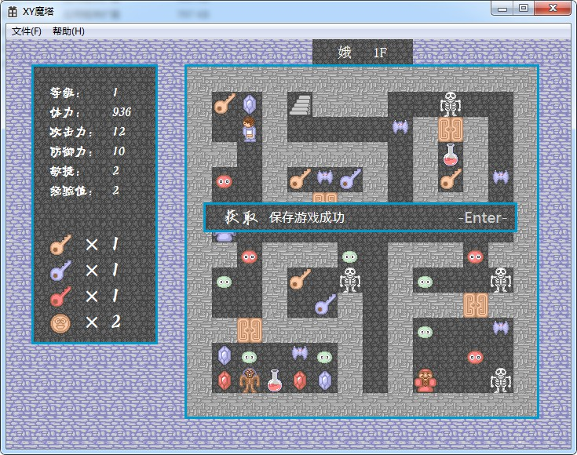
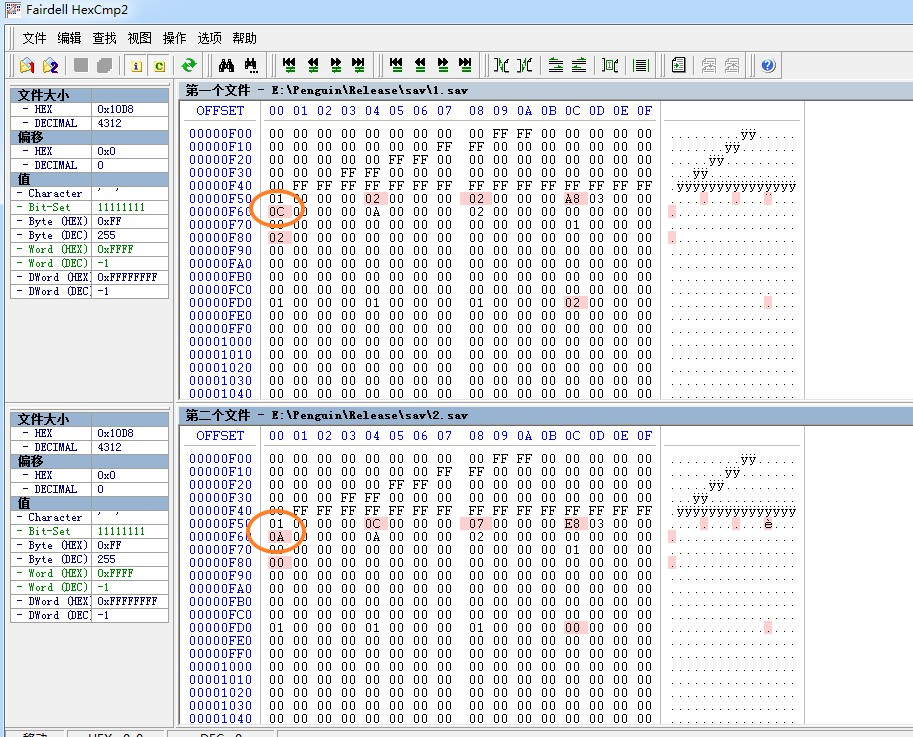
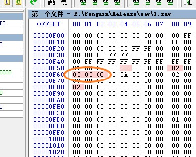
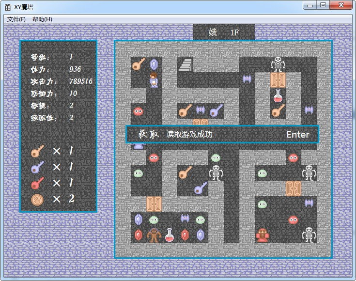
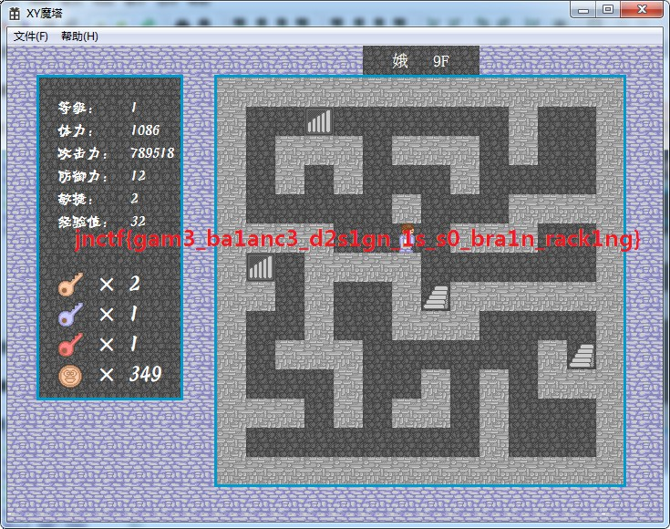

# JNCTF-2018 : mota

## **【原理】**

游戏外挂、修改器

## **【目的】**

通关魔塔

## **【环境】**

windows

## **【工具】**

WinCE、HexCmp

## **【步骤】**
##### 1 开局按s保存

##### 2 进入/sav，将1.sav改名为2.sav

#####  3 吃一个红宝石，加2攻击力

#####  4 按s保存

#####  5 使用二进制比较工具比较1.sav和2.sav 攻击力从10(0x0A)变成了12(0x0C) 很容易找到

##### 6 将攻击力0x0C修改为一个很大的值后保存为1.sav

##### 7 在游戏里，按a读档 ，此时攻击力十分强劲

##### 8 一路秒杀怪物，打败最终BOSS后截图，得到flag .

##### [另解思路]

- WinCE
- EXE资源提取器(MultiExtractor)

- 使用OD动态调试，解除文件CRC校验，修改data/monster.dat 中的怪物数据，使BOSS变弱
- 使用OD动态调试，更改初始化时的攻击力，使自己变强

## **【总结】**

有的游戏就算你技术再好，也不可能打通关的。