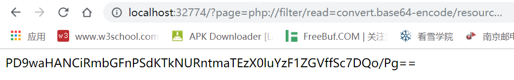

# Include

## **[目的]**
了解什么是文件包含

## **[原理]**
利用文件包含的漏洞读取服务器上的其他文件

## **[步骤]**


我们看到有page=，这不就是文件包含嘛

再一试发现flag.php存在

于是我们这样把flag.php以base64加密的状态弄出来

```
?page=php://filter/read=convert.base64-encode/resource=flag.php
```


解密得到flag


## **[工具]**
无