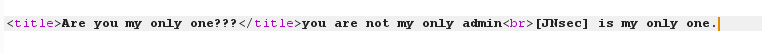

# only one

## **[目的]**
学会用burpsuite抓包并修改请求头。

## **[原理]**
判断未知响应头的值。

## **[步骤]**

使用burpsuite抓包，在返回的响应头中发现未知项`Whoareyou`，值为`guest`。

添加此请求头并修改为任意值，比如`admin`。
发现提示`[JNsec] is my only one.`

修改其值为`JNsec`，得到flag。

## **[工具]**

burpsuite