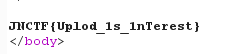

# 图片上传

## **[目的]**
学会绕过文件头校验和黑名单扩展名检测。
了解常见的危险脚本文件。

## **[原理]**
burpsuite抓包并修改文件头和扩展名。

## **[步骤]**

上传`gif`文件或文件头被修改为`GIF 89A`的其他类型文件。

使用burpsuite抓包，修改扩展名进行测试，尝试绕过黑名单。当扩展名为`php5`时，上传成功，得到flag。

## **[工具]**

burpsuite