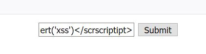
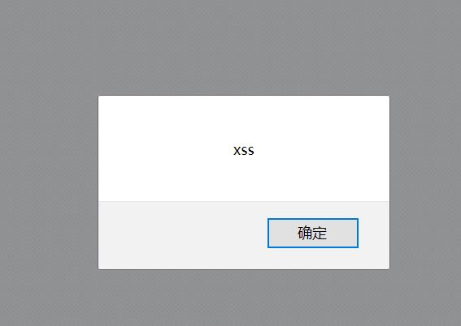
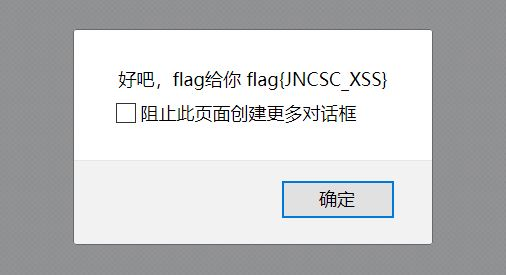
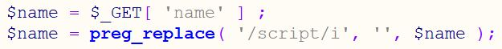

# xss

## **[目的]**
学会以及理解xss的产生原因

## **[原理]**
攻击者对含有漏洞的服务器发起XSS攻击（注入JS代码）。
诱使受害者打开受到攻击的服务器URL。
受害者在Web浏览器中打开URL，恶意脚本执行。
## **[步骤]**
在框框里输入
```
<scriscriptpt>alert('xss')</scrscriptipt>
```
点击submit提交



看到xss弹窗点击确定



flag弹出



源码里面过滤的语句长这样，通过正则匹配去掉一次script，所以scrscriptipt可以通过



## **[工具]**
浏览器